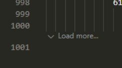
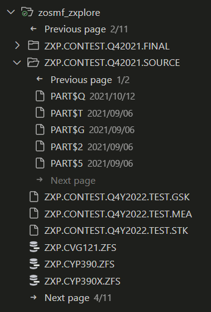

## `3.2.0`

### Job spool pagination

Large job spool files now load faster by displaying a `Load more…` button at the bottom to fetch additional lines as needed. For active jobs, use this button to retrieve new output without refreshing the jobs tree. It is recommended to use the default keybinding `Ctrl + L` to quickly load more lines. The number of lines per page and the toggle for pagination can be configured in the settings under `Zowe > Jobs > Paginate`. The default is 100 lines per page.



### Data set tree pagination

The data sets tree and any data sets with many members will now display `<- Previous page` and `-> Next page` navigation buttons to page through members. Only a subset of members is loaded at a time, allowing for large filters and data sets to load members faster. The number of members per page is configurable in the settings under `Zowe > Ds > Paginate`. The default is 100 members per page.



**Note:** Sorting is only applied within each page, while the overall member list is fetched by alphabetical, ascending order.

### Default sort order

The default sort order of every data set or job can now be changed. For example, to always open a data set to see the most recently edited members, set the default sort order to be by descending, date modified. The following settings are available:


Click on `Edit in settings.json` and it will open the file with a place to enter in desired values. Specify the method and direction - IntelliSense will provide all possible values. For example:

```json
"zowe.ds.default.sort": {
  "method": "LastModified",
  "direction": "Descending"
},
"zowe.jobs.default.sort": {
  "method": "DateCompleted",
  "direction": "Descending"
}
```

### Case sensitive & regex searching

Data set searches now support case sensitivity and regular expressions. Enable these options in the `Search PDS members` quick pick dialog.


### Advanced data set copy & paste

Data sets and members can now be copied and pasted within or across LPARs. Drag and drop is also supported for moving items between locations. Permission and attribute edge cases are handled with clear error messages.

### Improved USS filtering

The USS tree can now be filtered by any selected directory. Right-click a directory and select `Search by directory` to filter. Use the `Go Up One Directory` button to quickly adjust the filter to the parent directory.


### Profile info hover

Hovering over a data set, USS, or jobs profile now displays detailed connection information.


